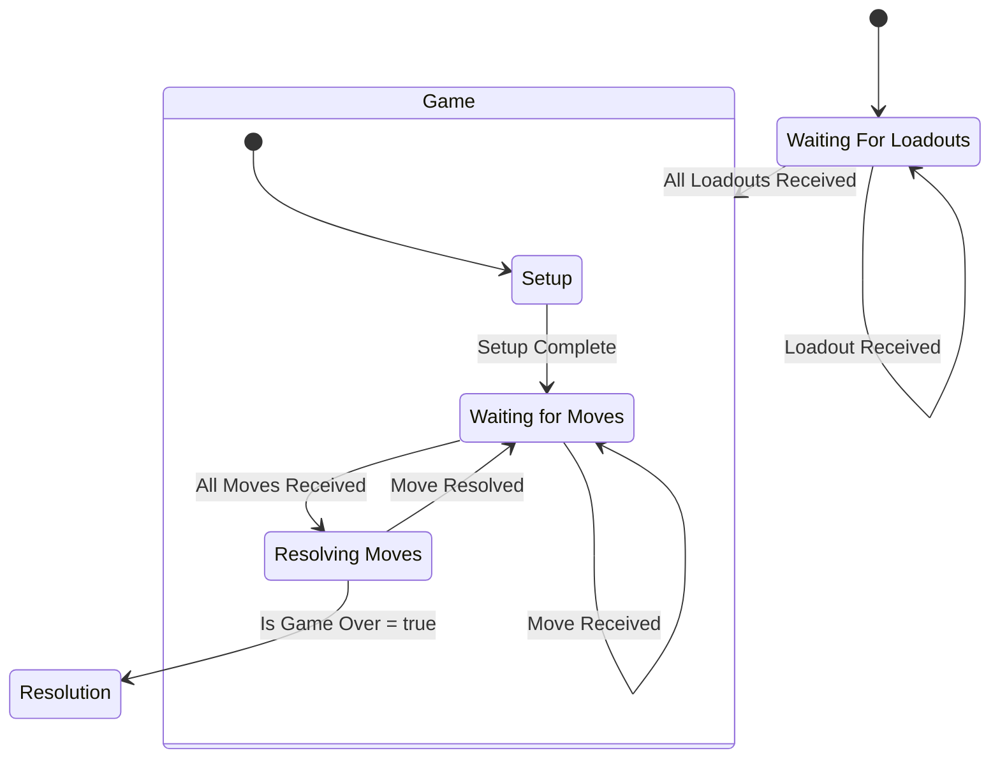
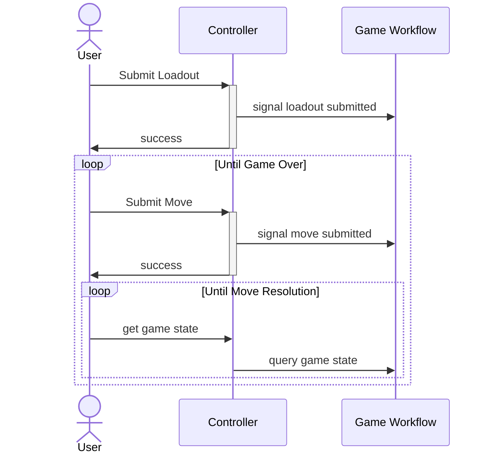

```mermaid
stateDiagram-v2
    state "Waiting For Loadouts" as loadouts
    [*] --> loadouts
    loadouts --> loadouts : Loadout Received
    state "Resolution" as resolution
    state Game {
      state "Setup" as setup
      [*] --> setup
      state "Waiting for Moves" as moves
      setup --> moves: Setup Complete
      moves --> moves: Move Received
      state "Resolving Moves" as resolving
      moves --> resolving: All Moves Received
      resolving --> moves: Move Resolved
      
    }
    loadouts --> Game : All Loadouts Received
    resolving --> resolution: Is Game Over = true
```

```mermaid

sequenceDiagram
  actor line_1 as User
  participant line_2 as Controller
  participant line_3 as Game Workflow
  line_1 ->>+ line_2: Submit Loadout
  line_2 ->> line_3: signal loadout submitted
  line_2 ->>- line_1: success
  loop Until Game Over
    line_1 ->>+ line_2: Submit Move
    line_2 ->> line_3: signal move submitted
    line_2 ->>- line_1: success
    loop Until Move Resolution
      line_1 ->> line_2: get game state
      line_2 ->> line_3: query game state
    end
  end
```
